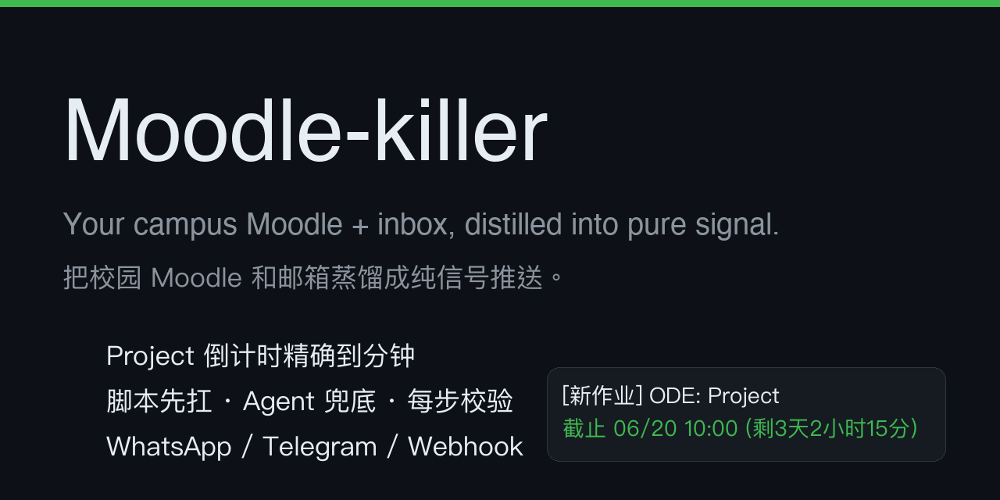

# Moodle-killer

> *The Moodle system is so annoying, that's why the project exists.*

<!-- 顶部预览图：把图片放进 docs/ 目录后引用，支持控制宽度与居中 -->
<p align="center">
  
</p>

<p align="center">
  
  
  
</p>

## 写在前面

### 为什么做这个项目？

很简单：
每天上课前都要点开 Moodle，一个个课程查看是否有新课件要下载，还要手动勾选那个 Done 让进度条保持 100%，非常烦人。
所以开发了这个工具，把重复动作省下来的时间留给自己。

### 核心目标

1. **一学期配置一次，一劳永逸**，减少 90% 手动开启 Moodle 找东西的次数
2. **任何 Agent 框架都能用**，即使是豆包 (bushi) 
3. **满足个性化需求** → 例如详细到哪种文件存到哪个本地文件夹

### 可能存在的问题

1.我的账号密码安全吗？
绝对安全，一旦你下载了 Skill，这个 Skill 就是你的，不会把数据传输到我这，也不会被 Agent 挂到网上。
2.这个 skill 怎么使用？
有一个 Agent 框架，告诉它装这个就好，AI 时代，你至少有一个 ChatGPT，对于中国用户来说豆包可能更多
3.有一些我平常用的功能这个 skill 没有怎么办？
直接在 Issue 里面描述问题提交给我即可，如果你有一点点代码开发基础的话，自己改也是可以的，我留了一份文档供你的 Agent 参考
4.This skill doesn‘t have my first language
This skill is for XMUM student temporarily, but the student whose university uses Moodle also can use by changing the default page. Considering there must be many people from non-speaking-English country, I will try to add more languages as I know. Please create issue to here if your mother tongue isn't here.
5.可能存在更多我没想过的问题
这很合理，出现问题既有你的打开方式不对，也有我的设计失误，所以无论多奇怪的问题都可以 issue 我，这样我能了解在存在的设计不足或是功能缺失。

---

**学业通知 Agent**：定时抓 Moodle 课程动态 → 过滤噪音 → 关键词分类 → 高密度摘要推送。可在任意本地 Agent（Hermes / Claude Code / Codex / Workbuddy / 豆包 …）或纯 cron 环境运行。

```text
[定时触发] → 抓取 → 噪音过滤 → 关键词分类
     ├─ 命中 → 输出
     ├─ 未命中 → Agent 读用户规则兜底判断
     └→ 每步校验 → 推送
```

## 特性

- **本地安全**：凭据留本地，不传外部服务，无需担心泄露
- **脚本先行，Agent 兜底**：规则命中全走脚本；拿不准才交 Agent —— 极速、稳定、不超时
- **一句话改配置**：`mk set 时间 07:00`、`mk output silent`、`mk add 数学分析`
- **5 种推送风格**：天天报到 / 没事不扰 / 每日汇总 / 只报紧急 / 全量推送
- **时分倒计时**：`[新作业] ODE: Project 截止 06/20 10:00 (剩3天2小时15分)`

## 快速开始

### 安装

**Mac / Linux：**
```bash
git clone https://github.com/ClarenceXMUM/Moodle-killer.git
cd Moodle-killer
./install.sh          # 检查依赖 + 装到 3 个标准技能目录 + 生成 mk 命令
```

**Windows：**
用 PowerShell 运行 `install.ps1`。

### 初始化与测试

```bash
mk setup              # 快速配置
mk test               # 检测是否运行正常
mk                    # 查看当前状态（配置 / 课程 / 下次推送）
```

不想用命令行？直接在常用 Agent 聊天里说：
> 「配置 moodle」「moodle 状态」「moodle 改推送时间 07:00」

## 常用命令

| 命令 | 作用 |
|---|---|
| `mk` | 查看当前状态 |
| `mk setup` | 引导式配置 |
| `mk set 时间 07:00` | 改一项配置；不带值查看当前值 |
| `mk add` / `mk rm 课名` | 加课 / 删课 |
| `mk output silent` | 换推送风格（heartbeat / silent / digest / urgent / full） |
| `mk channel [通道]` | 换推送通道（auto / local / telegram / webhook / ntfy） |
| `mk test` | 试跑，不推送 |
| `mk find 概率` | 智能找课件文件夹 |
| `mk doctor` | 检查环境与状态，给出修复建议 |
| `mk sandbox` | 创建隔离测试环境，不碰现有配置 |
| `mk pause` / `mk resume` | 暂停 / 恢复推送 |
| `mk help` | 全部命令 |

更多命令（`mk output --demo`、`mk mute`、`mk schedule`、`mk set --advanced`、任何命令加 `--json`）→ `mk help`，或看 [`moodle-killer/references/CONFIG.md`](moodle-killer/references/CONFIG.md)。

## 5 种推送风格

<!-- 输出效果对比图：截屏后放进 docs/ 目录引用 -->
<p align="center">
  
</p>

```bash
mk output --demo      # 预览 5 种风格（并排打印，不联网不推送）

mk output heartbeat   # 默认：没事也报一句「已扫5课 无新内容」
mk output silent      # 没事完全不说话
mk output digest      # 每天一条汇总
mk output urgent      # 只报 24h 内截止 + 新成绩
mk output full        # 全都报
```

实际输出样例与对比说明 → [`moodle-killer/references/OUTPUT-MODES.md`](moodle-killer/references/OUTPUT-MODES.md)

## 推送通道

默认通道为 `auto`：Agent 里直接回显，后台定时任务走系统通知。

需要推送到其他设备，可指定通道：

| 通道 | 需要配什么 | 适用 |
|---|---|---|
| `auto` | 无 | 自动跟随环境（默认） |
| `local` | 无 | 本机通知 + 本地文件 |
| `telegram` | bot token + chat_id | 通用，零门槛 |
| `webhook` | URL | 钉钉 / 飞书 / 企业微信 / 自建 |
| `ntfy` | topic 名 | 手机推送，免注册 |
| `hermes` | Hermes 网关 | Hermes 生态 |
| `none` | 无 | 只跑脚本看 stdout |

```bash
mk channel telegram
mk set delivery.telegram.bot_token <token>
mk set delivery.telegram.chat_id <id>
```

## 你的数据住在哪

```text
~/.moodle-killer/            ← 不在仓库里，升级/重装不丢
├── config.yaml              # 账号 + 偏好（权限 600）
├── courses.json             # 目前盯的课
├── user_requirements.md     # 你的个性化规则（Agent 读）
├── out/                     # signals.txt / unclassified_moodle.json / verify_report.txt
├── state/                   # 每门课「已见过」记录
└── logs/
```

`MOODLE_KILLER_HOME` 可覆盖这个位置。老版本放在仓库里的配置会自动迁移过来。

## 目录结构

```text
Moodle-killer/
├── install.sh                       # 一键安装（macOS / Linux）
├── install.ps1                      # 一键安装（Windows / PowerShell）
├── moodle-killer/                   # 技能包（可整体复制到任意助手）
│   ├── SKILL.md                     # 技能说明（命令 / 触发词 / 风格 / 规矩）
│   ├── scripts/
│   │   ├── mk.py                    # 唯一命令入口
│   │   ├── moodle_prep.py           # 主流程：抓取 + 分类 + 校验 + 输出
│   │   ├── moodle_client.py         # Moodle HTTP 客户端
│   │   ├── config_store.py          # 配置/数据目录的唯一真相源
│   │   ├── onboarding.py            # 引导式配置
│   │   ├── sender.py                # 推送通道（auto 跟随平台）
│   │   ├── platform_support.py      # 平台差异分支（Mac / Windows / Linux）
│   │   ├── pathfinder.py            # 自动找课件文件夹 + 编号挑选
│   │   ├── sandbox.py               # 隔离测试环境（mk sandbox）
│   │   ├── verify.py                # 步骤校验 + 自检
│   │   └── harness_install.py       # 装到 3 个标准技能目录
│   ├── references/                  # 配置 / 风格 / 排障 / 沙盒细则
│   ├── templates/                   # 配置模板
│   └── agents/                      # 框架专属适配（预留）
└── docs/                            # 架构图等
```

## 设计原则

1. **脚本处理确定逻辑**：抓取、过滤、算倒计时、做校验，稳定秒级跑完
2. **规则外置于文件**：专属规则写进 Markdown，改需求不碰代码
3. **Agent 专职裁决**：只审兜底队列，判断是否值得推，严守输出格式
4. **关键步骤强校验**：各环节自检，出错直接报错，拒绝残缺推送
5. **技能只读，数据外置**：配置和数据放本地目录，升级更新不丢数据

## 致谢 / License

MIT — 见 [LICENSE](LICENSE)。贡献指南见 [CONTRIBUTING.md](CONTRIBUTING.md)。
